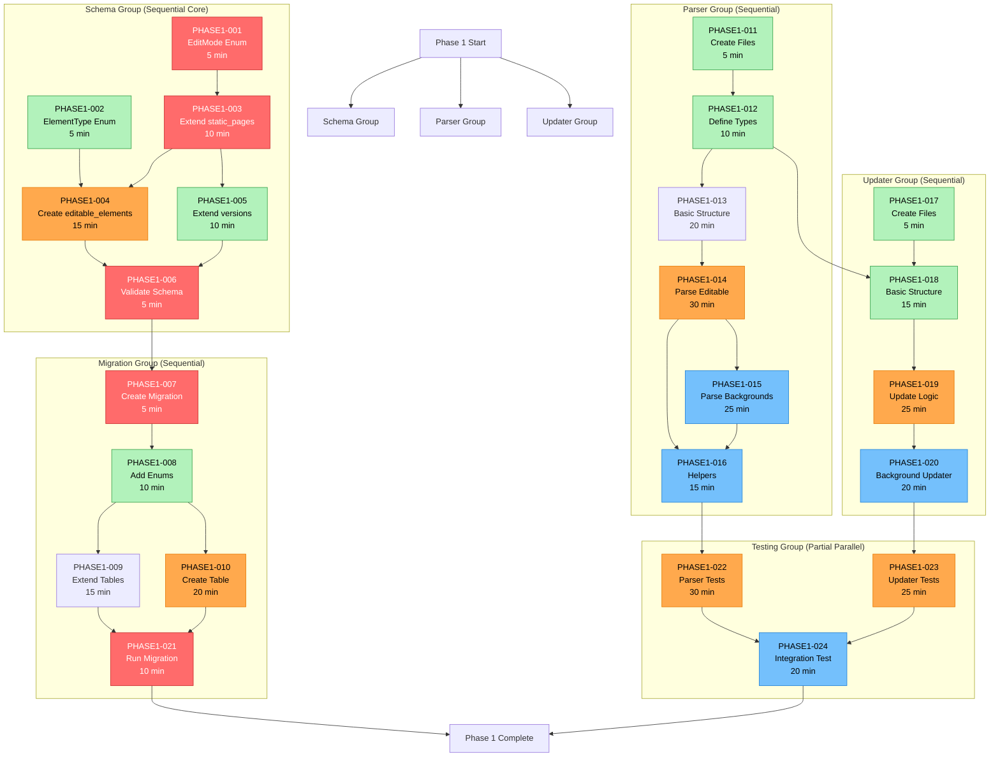
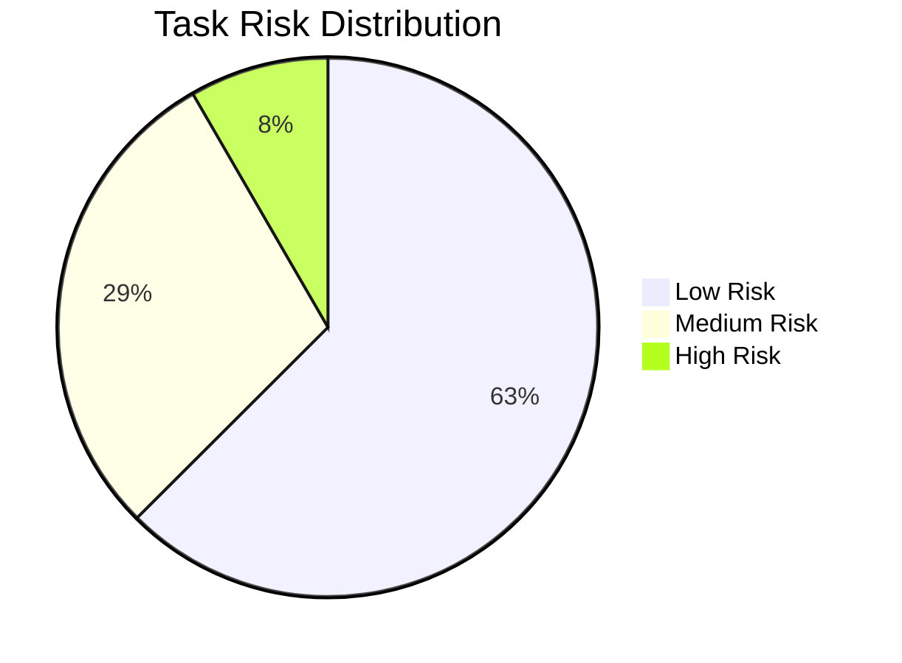

# Phase 1 Task Dependency Diagram

## Visual Dependency Flow



---

## Parallel Execution Opportunities

```mermaid
gantt
    title Phase 1 Parallel Execution Timeline
    dateFormat HH:mm
    axisFormat %H:%M

    section Schema
    T001 EditMode      :crit, t001, 09:00, 5m
    T002 ElementType   :crit, t002, 09:00, 5m
    T003 Extend Pages  :crit, t003, after t001, 10m
    T004 Create Elem   :crit, t004, after t003, 15m
    T005 Extend Vers   :t005, after t003, 10m
    T006 Validate      :crit, t006, after t004 t005, 5m

    section Migration
    T007 Create Mig    :crit, t007, after t006, 5m
    T008 Add Enums     :t008, after t007, 10m
    T009 Tables        :t009, after t008, 15m
    T010 Create Table  :t010, after t008, 20m
    T021 Run Mig       :crit, t021, after t009 t010, 10m

    section Parser
    T011 Files         :t011, 09:00, 5m
    T012 Types         :t012, after t011, 10m
    T013 Structure     :t013, after t012, 20m
    T014 Parse Edit    :t014, after t013, 30m
    T015 Parse BG      :t015, after t014, 25m
    T016 Helpers       :t016, after t015, 15m

    section Updater
    T017 Files         :t017, 09:05, 5m
    T018 Structure     :t018, after t017 t012, 15m
    T019 Logic         :t019, after t018, 25m
    T020 BG Update     :t020, after t019, 20m

    section Testing
    T022 Parser Test   :t022, after t016, 30m
    T023 Update Test   :t023, after t020, 25m
    T024 Integration   :crit, t024, after t022 t023 t021, 20m
```



---

## Critical Path (Longest Sequential Chain)

**Total Duration on Critical Path**: ~130 minutes (2h 10min)

```
START
  ↓ 5 min
[PHASE1-001] EditMode Enum
  ↓ 10 min
[PHASE1-003] Extend static_pages
  ↓ 15 min (includes wait for 002→004)
[PHASE1-004] Create editable_elements
  ↓ 5 min (wait for 005)
[PHASE1-006] Validate Schema
  ↓ 5 min
[PHASE1-007] Create Migration
  ↓ 10 min
[PHASE1-008] Add Enums
  ↓ 20 min (longer of 009/010)
[PHASE1-010] Create Table
  ↓ 10 min
[PHASE1-021] Run Migration
  ↓ 0 min (parallel wait for tests)
[Tests Complete]
  ↓
PHASE 1 COMPLETE
```

---

## Parallel Work Streams

### Stream A: Schema → Migration (Critical Path)
```
Time 0:00 → PHASE1-001 (5m)
Time 0:05 → PHASE1-003 (10m)
Time 0:15 → PHASE1-004 (15m) [wait for PHASE1-002]
Time 0:30 → PHASE1-006 (5m) [wait for PHASE1-005]
Time 0:35 → PHASE1-007 (5m)
Time 0:40 → PHASE1-008 (10m)
Time 0:50 → PHASE1-010 (20m)
Time 1:10 → PHASE1-021 (10m)
Time 1:20 → COMPLETE
```

### Stream B: Parser (Independent)
```
Time 0:00 → PHASE1-011 (5m)
Time 0:05 → PHASE1-012 (10m)
Time 0:15 → PHASE1-013 (20m)
Time 0:35 → PHASE1-014 (30m)
Time 1:05 → PHASE1-015 (25m)
Time 1:30 → PHASE1-016 (15m)
Time 1:45 → Parser Ready for Tests
```

### Stream C: Updater (Mostly Independent)
```
Time 0:00 → PHASE1-017 (5m)
Time 0:05 → [wait for PHASE1-012]
Time 0:15 → PHASE1-018 (15m)
Time 0:30 → PHASE1-019 (25m)
Time 0:55 → PHASE1-020 (20m)
Time 1:15 → Updater Ready for Tests
```

### Stream D: Testing (After Components Ready)
```
After Parser (1:45) & Updater (1:15) & Migration (1:20):
Time 1:45 → PHASE1-022 (30m) || PHASE1-023 (25m) [PARALLEL]
Time 2:15 → PHASE1-024 (20m)
Time 2:35 → ALL COMPLETE
```

---

## Optimal Execution Strategy

### Strategy 1: Single Developer (Sequential with Smart Ordering)
**Estimated Total Time**: 2h 35min

```
1. Start Parser Foundation (PHASE1-011, 012) - 15 min
2. Start Schema Work (PHASE1-001, 002, 003) - 20 min
3. Continue Parser (PHASE1-013, 014) - 50 min [while thinking about schema]
4. Complete Schema (PHASE1-004, 005, 006) - 35 min
5. Complete Parser (PHASE1-015, 016) - 40 min
6. Start Updater (PHASE1-017, 018, 019, 020) - 65 min
7. Migration Work (PHASE1-007-010, 021) - 60 min
8. Testing (PHASE1-022, 023, 024) - 75 min

Total: ~6 hours with context switching
```

### Strategy 2: Parallel Development (Recommended)
**Estimated Total Time**: 2h 35min (with proper parallelization)

```
Session 1 (Morning - 2h):
├─ Terminal 1: Schema (001→002→003→004→005→006) [50 min]
├─ Terminal 2: Parser (011→012→013→014) [65 min]
└─ Terminal 3: Updater (017→[wait]→018→019) [45 min after types]

Session 2 (Afternoon - 2h):
├─ Terminal 1: Migration (007→008→009→010→021) [60 min]
├─ Terminal 2: Parser completion (015→016) [40 min]
└─ Terminal 3: Updater completion (020) [20 min]

Session 3 (Testing - 1.5h):
├─ Terminal 1: Parser tests (022) [30 min]
├─ Terminal 2: Updater tests (023) [25 min] PARALLEL
└─ Terminal 3: Integration (024) [20 min] AFTER

Total: ~3.5 hours with parallel execution
```

---

## Task Grouping by Complexity

### Quick Tasks (≤10 min) - Good for Momentum
```
✅ PHASE1-001: EditMode enum (5 min)
✅ PHASE1-002: ElementType enum (5 min)
✅ PHASE1-006: Validate schema (5 min)
✅ PHASE1-007: Create migration (5 min)
✅ PHASE1-011: Parser files (5 min)
✅ PHASE1-017: Updater files (5 min)
✅ PHASE1-008: Add enums (10 min)
✅ PHASE1-012: Types (10 min)
✅ PHASE1-003: Extend pages (10 min)
✅ PHASE1-005: Extend versions (10 min)
✅ PHASE1-021: Run migration (10 min)
```

### Medium Tasks (15-25 min) - Core Development
```
⚡ PHASE1-004: Create editable_elements (15 min)
⚡ PHASE1-009: Extend tables (15 min)
⚡ PHASE1-016: Helpers (15 min)
⚡ PHASE1-018: Updater structure (15 min)
⚡ PHASE1-024: Integration test (20 min)
⚡ PHASE1-010: Create table (20 min)
⚡ PHASE1-013: Parser structure (20 min)
⚡ PHASE1-020: Background updater (20 min)
⚡ PHASE1-015: Background parsing (25 min)
⚡ PHASE1-019: Update logic (25 min)
⚡ PHASE1-023: Updater tests (25 min)
```

### Long Tasks (≥30 min) - Focus Time Required
```
🎯 PHASE1-014: Parse data-editable (30 min)
🎯 PHASE1-022: Parser tests (30 min)
```

---

## Risk Assessment & Mitigation

### High-Risk Tasks


**High Risk Tasks**:
- **PHASE1-010**: Complex SQL migration
  - Mitigation: Review SQL syntax, test in dev DB first
- **PHASE1-021**: Migration execution
  - Mitigation: Backup database, test rollback procedure

**Medium Risk Tasks**:
- PHASE1-014, 015: Complex parsing logic
  - Mitigation: Incremental development, frequent testing
- PHASE1-019, 020: HTML manipulation
  - Mitigation: Test with various HTML structures

---

## Success Criteria Checklist

### Technical Validation
- [ ] Schema passes `npx prisma validate`
- [ ] TypeScript compiles with `npx tsc --noEmit`
- [ ] Migration applies successfully
- [ ] All database constraints created
- [ ] Parser extracts TEXT elements
- [ ] Parser extracts HTML elements
- [ ] Parser extracts IMAGE elements
- [ ] Parser extracts BACKGROUND elements
- [ ] Updater modifies TEXT correctly
- [ ] Updater modifies HTML correctly
- [ ] Updater modifies IMAGE correctly
- [ ] Updater modifies BACKGROUND correctly
- [ ] HTML sanitization works
- [ ] Validation prevents malicious content

### Test Coverage
- [ ] Parser tests: >95% coverage
- [ ] Updater tests: >95% coverage
- [ ] Integration test passes
- [ ] All edge cases covered
- [ ] Error cases handled

### Quality Standards
- [ ] No TypeScript `any` types
- [ ] No console.log statements
- [ ] No debugger statements
- [ ] All functions documented
- [ ] Error messages are clear
- [ ] Code follows project conventions

---

**Diagram Version**: 1.0
**Last Updated**: 2025-10-29
**Tool**: Mermaid.js
